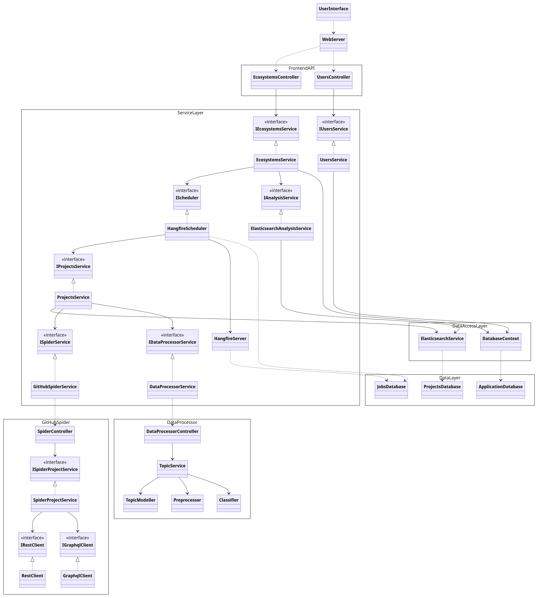

# Secodash documentation
Secodash (Software-Ecosystems) is a web-application which gathers, analyses and displays ecosystems. 

# Running Secodash
Secodash is fully containerized with Docker. As such it is portable and easy to run. You only need to download [Docker](https://docs.docker.com/get-docker/) to be able to run the project.
Furthermore this project needs a [personal access](https://docs.github.com/en/authentication/keeping-your-account-and-data-secure/managing-your-personal-access-tokens) token from an account on GitHub in order to query data and a valid ssl certificate and private key.

## Managing secrets
This project has some private information which is not included "out-of-the-box". As such we need to add this information manually, namely.

- Database password
- SSL certificate and private key
- github personal access token 

In order to include this information we need to make a directory called `secrets`. In this directory we add these files.

- db-password.txt
- fullchain.pem
- privkey.pem
- spider-git-api-token.txt

Some notes:  
- You do not need to include a database name it will automatically use the postgress database as default.
- If you want to use a already pre-existing database you need to add it as a volume in the Docker compose file. 
- The project needs a valid ssl certificate to properly work. If running locally make sure you have a valid certificate for localhost.
- It does not matter in which format the certificates are as long as you make sure they are properly referenced in the Docker compose file.

Once you have done this you are ready to start running the project.

## Running locally

We have included a batch file run.bat you can use to start up the project. Below we have outlined how it works.

When in Docker applications use the docker network to communicate instead of ports on localhost. So before we start up our project this the network needs to be created first.

`$ docker network create secodash-network`

Next we compose the project.

`$ docker compose up --build`

This builds all our applications into images which will then be ran as containers ([Docker documentation](https://docs.docker.com/guides/get-started/)). Building the images can take a while (10 minutes), however this only needs to be done once. Running the images as containers will only take a few seconds. In this command the `--build` flag is optional. However it will make Docker rebuild an image if you change the source code.

After this you have the project running. You can find the application at localhost and use Docker Desktop to inspect the containers.

## Running in production

If you want to run docker on a remote server you need to install the Docker deamon there first (you do **not** need docker desktop). Afterwards you need to create a Docker network and compose the project like you do locally.

The docker compose file we use locally has some extra development features which aren't needed in a production enviroment. As such we use a different compose file for running the project in a production enviroment.

`$ docker compose -f server-compose.yml up --build`

If you intend to continue developping this project it is recommended to be able to run everything outside of docker.

# Overview of All Applications

The structure of the project is made up of 4 different branches.
- Front-end
- Back-end
- Spider
- Data processor

## Back-end (service)

[Go to back-end documentation](https://aukeijzer.github.io/Software-Ecosystems/documentation/backend/index.html)

Typically a 'back-end' in a project is viewed as everything which happens behind the scenes. From this perspective other parts of the project, such as the dataprocessor and spider can both be seen as back-end. **In our project we use a different definition for back-end.** We see the back-end as the application which manages communication between applications. All applications only communicate with the back-end. As such the back-end can be seen as the glue which holds everything together.

The back-end consists of a .NET application which keeps a connection with a SQL and a Elasticsearch database.

The application runs on a postgres

### Elasticsearch database

##3 Running outside of an container
In order to run the spider you need to install [C# .net 8.0](https://dotnet.microsoft.com/en-us/download/dotnet/8.0) and [PostgreSQL](https://www.postgresql.org/download/). While installing postgress it is recommended to also install the database-browser pgadmin4 via the installer.

Afterwards you can open the project solution in your IDE (visual studio or rider) and run it using the http profile. 

## Front-end

[Go to front-end documentation](front-end/README.md)

The front-end uses

### Nginx
Nginx is used as a reverse proxy to handle ssl certification so the application can run on https. It just handles ssl certification and passes all requests on to the nodejs server. We have a config file to run Nginx in a docker container located at front-end/nginx,

### Next.js

Next.js is a React framework that simplifies the process of building server-side rendered (SSR) and statically generated web applications. It is designed to enhance the developer experience by providing a set of conventions and tools for quickly creating robust and scalable web applications.

### Running outside of a container
Outside of a container we just run the Next.js on http so we do not need Nginx. In order to use Next.js we first need to download [Node.js and npm](https://docs.npmjs.com/downloading-and-installing-node-js-and-npm). 

1. Open the project folder to frontend/ecodash
2. Open a new terminal in the folder
3. Run the following command "npm ci". This chain installs all required packages
4. to run the front-end in development mode excecute: `npm run dev`
5. To run the front-end in production mode execute: `npm run build` followed by `npm start`

### Testing
Front-end testing is doen with Cypress and Jest. Cypress is used for component testing and e2e tests. Jest is used for all seperate functions.

#### Cypress testing
To start testing with cypress follow these steps:
1. Open the projet folder to frontend/ecodash
2. Open a new terminal
3. Run the following command: `npm run dev`
4. Open a second new terminal
5. Run the following command: `npx cypress open`
6. This opens up a new window with two options: e2e testing / component
7. Click on the chosen option
8. Click specs and click on the green start icon to run the selected tests

#### Jest testing
To start testing with jest follow these steps:
1. Open the project folder to `frontend/ecodash`
2. Open a new terminal
3. Run the following command: `npm run test`
4. Supply the command with the following flag `--verbose` to see additional test information

## Spider

### Spider functionality
The Spiders job is to mine the repositories of of GitHub. It does this using the GitHub Rest and GraphQL apis.

### Running outside of a container
In order to run the spider you need to install [C# .net 8.0](https://dotnet.microsoft.com/en-us/download/dotnet/8.0). 

Afterwards you can open the project solution in your IDE (visual studio or rider) and run the project using the http profile.

### Documentation
[Go to spider documentation](spider/README.md)

## Data Processor
[Go to data processor documentation](data_processor/README.md)

### Running outside of a container
#### Step 1: Create and Activate a Virtual Environment (please make sure python==3.9 is installed)*

Once you have installed python you need to open the data_processor directory in the commandline and install all dependencies

`$ python -m venv .venv`

`$ .venv\Scripts\activate`

#### Step 2: Install Dependencies

After activating the virtual environment, install project dependencies from `requirements.txt`:

`$ pip install -r requirements.txt`

#### Step 3: Run the Application

Once dependencies are installed run the `app.py` file in src directory:

`$ python src/app.py`

In order to run the dataprocessor you need to [install python](https://www.python.org/downloads/release/python-390/). Make sure you install version 3.9. **Other versions are not supported.** 

### Running tests

#### Step 1: Set Up Environment
Follow all previous steps to run data processor outside of a containter

#### Step 2: Run Tests
Run all tests using the following command:

`$ python -m unittest discover -s tests -p 'test_*.py'`
